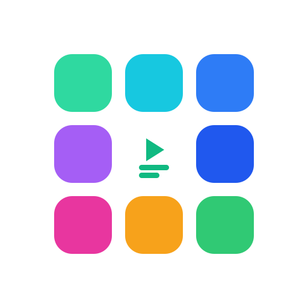
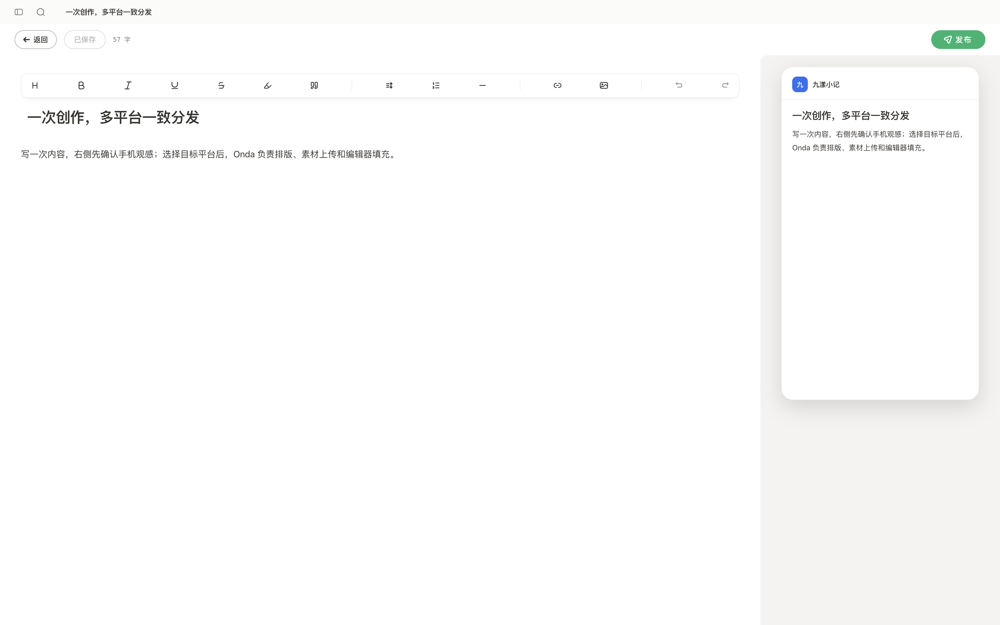
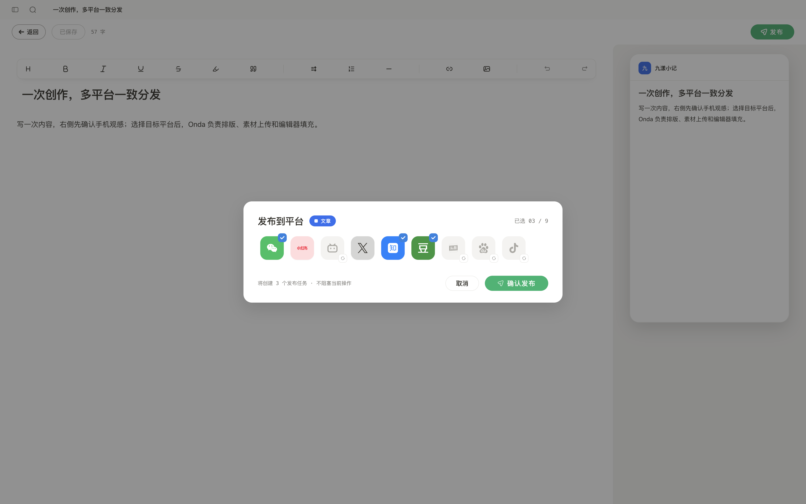
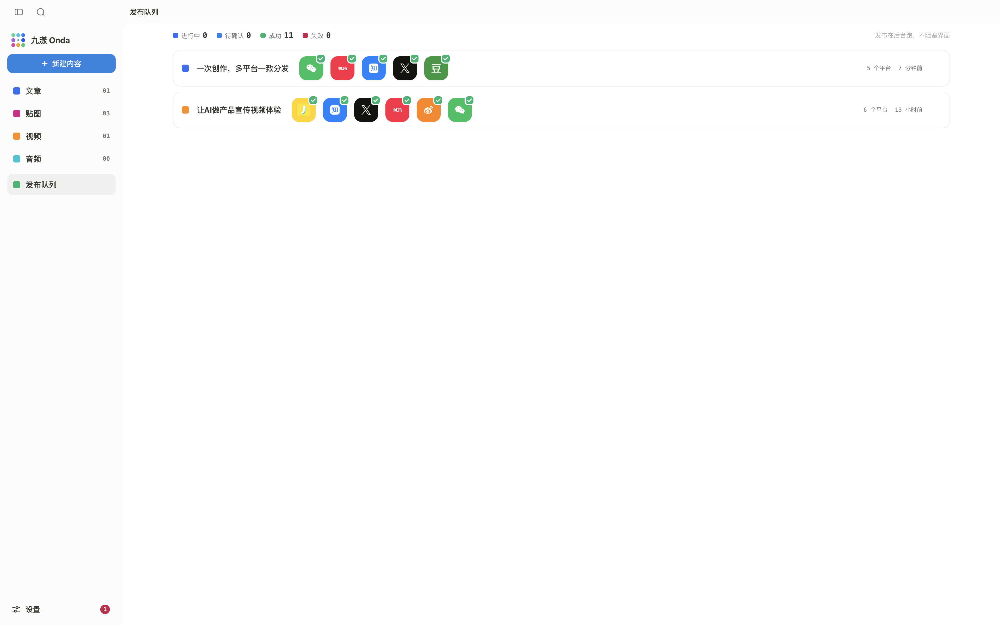
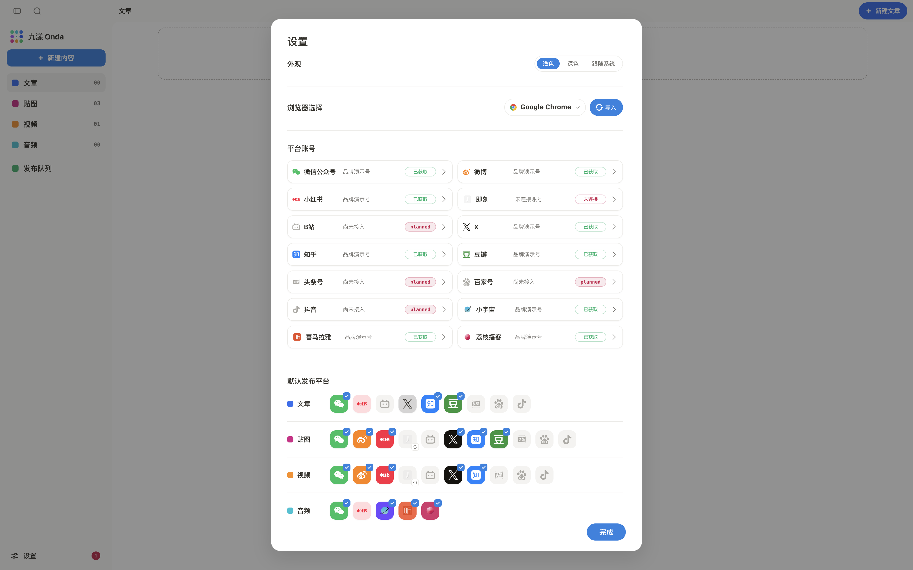
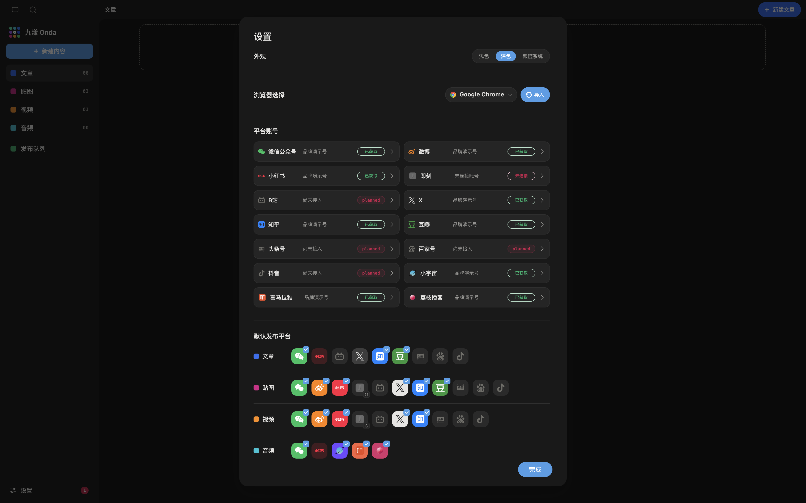

<p align="center">
  
</p>

<h1 align="center">九漾 Onda — 多平台内容发布工作台</h1>

**九漾 Onda** 是一个面向中文创作者的多平台内容发布工作台。统一管理文章、贴图、视频和音频，通过平台适配器和浏览器自动化，将一份内容分发至 10+ 平台。

[](#) [](#) [](#) [](#) [](#) [](#) [](#license)

<p align="center">
  <video src="https://github.com/amlei/tassello/releases/download/v0.1.0/tassello-intro-share.mp4" controls muted loop playsinline preload="metadata" width="100%"></video>
</p>

## 它解决什么问题？

如果你同时在公众号、小红书、知乎、微博、播客平台等内容渠道发布，你需要：

1. 在每个平台后台分别登录
2. 手动复制标题、正文、图片
3. 逐个上传素材、调整排版
4. 分别检查发布效果
5. 在多个后台之间切换确认状态

**九漾 Onda 把这些步骤集中到一个工作台：**

- 内容只写一份，放在统一内容库里
- 平台适配器自动准备标题、正文、素材和表单
- 发布进度集中在一个队列里查看
- 关键平台动作仍由你确认，安全和节奏掌握在你手里

## 支持哪些平台？

| 平台 | 内容类型 | 发布通道 | 状态 |
|------|----------|----------|------|
| 微信公众号 | 文章 / 贴图 / 视频 / 播客 | CDP | ✅ 已接入 |
| 小红书 | 贴图 | CDP | ✅ 已接入 |
| 知乎 | 文章 | CDP | ✅ 已接入 |
| 微博 | 短文 / 贴图 | CDP | ✅ 已接入 |
| X (Twitter) | 短文 / 贴图 | CDP | ✅ 已接入 |
| 即刻 | 短文 / 贴图 | CDP | ✅ 已接入 |
| 豆瓣 | 短文 / 贴图 | CDP | ✅ 已接入 |
| 小宇宙 | 播客 | CDP | ✅ 已接入 |
| 喜马拉雅 | 播客 | CDP | ✅ 已接入 |
| 荔枝播客 | 播客 | CDP | ✅ 已接入 |
| 抖音 | 视频 | 规划中 | 🔜 |
| B站 (Bilibili) | 视频 | 规划中 | 🔜 |
| 头条号 | 文章 | 规划中 | 🔜 |
| 百家号 | 文章 | 规划中 | 🔜 |
| RSS | 全类型 | 规划中 | 🔜 |

> **发布通道说明：** CDP（Chrome DevTools Protocol）通过浏览器自动化准备内容页面，需要人工确认的平台会在流程中暂停，由你完成最后发布。API 通道为增强能力，按平台逐个接入。

## 界面预览

### 编辑器 — 实时手机预览



### 多平台发布设置



### 发布队列 — 集中管理发布状态



### 浅色 / 深色主题

| 浅色模式 | 深色模式 |
|----------|----------|
|  |  |

## 工作原理

```
统一内容库 → 编辑器 → 平台适配器 → 发布队列 → 人工确认
                ↑                        ↓
           本地 SQLite            Chrome CDP / 平台 API
```

1. **统一内容库**：文章、贴图、视频、音频作为一等公民管理，数据存储在本地 SQLite。
2. **编辑器**：富文本编辑，内置实时手机预览，排版效果在提交前即可检查。
3. **平台适配器**：根据平台规则自动准备标题、正文、素材和表单，支持 Chrome CDP 浏览器自动化。
4. **发布队列**：所有发布任务集中展示，显示阶段、进度、错误和待确认状态。
5. **人工确认**：自动化完成后，需要人工确认的平台会暂停，由你完成最后发布或确认回执。

## 技术栈

| 层 | 技术 | 说明 |
|----|------|------|
| 前端 | Next.js 16 / React 19 / Tailwind CSS 4 / HeroUI v3 | App Router + Turbopack |
| 类型 | TypeScript 7 (tsgo native preview) | 全仓严格类型检查 |
| 后端 | Next.js Route Handlers + packages/server | 业务逻辑独立于 UI 层 |
| 数据 | Prisma + SQLite (@prisma/adapter-libsql) | 本地单用户，无云端依赖 |
| 桌面 | Electron | 可选宿主，网页模式独立运行 |
| 浏览器自动化 | Chrome DevTools Protocol (CDP) | 平台主发布通道 |
| Obsidian 插件 | esbuild + Obsidian API | 笔记直接发布到多平台 |
| 测试 | Bun Test | CDP 层单元测试 |

## 和现有方式有什么不一样？

| | 手动发布 | 群发工具 | 九漾 Onda |
|---|---|---|---|
| 内容只写一份 | ❌ 每个平台复制粘贴 | ✅ | ✅ |
| 按平台规则适配排版 | ❌ 手动逐个调整 | ❌ 统一格式忽略差异 | ✅ 适配器自动处理 |
| 人工最后确认 | ✅ 你自己在平台操作 | ❌ 无人值守直接发 | ✅ 流程中明确暂停 |
| 发布状态集中查看 | ❌ 逐个后台切换 | ✅ | ✅ 统一队列 |
| 安全性 | ✅ | ❌ 脚本直接操作 | ✅ 关键动作由你控制 |

## 常见问题

### 九漾 Onda 是群发工具吗？

不是。九漾 Onda 帮你减少重复上传和复制粘贴，但不会替代你做最终发布决定。需要人工确认的平台会明确暂停，由你检查结果后再完成发布。

### 九漾 Onda 支持哪些平台？

目前已接入微信公众号、小红书、知乎、微博、X (Twitter)、即刻、豆瓣、小宇宙、喜马拉雅、荔枝播客共 10 个平台。抖音、B站、头条号、百家号、RSS 在规划中。

### 九漾 Onda 的数据存在哪里？

所有数据（内容、素材、账号配置、发布记录）存储在本地 SQLite 数据库中，不依赖云端服务器。数据目录默认在 `~/.local/share/tassello`。

### 九漾 Onda 如何发布到平台？

主要通过 Chrome DevTools Protocol (CDP) 驱动真实浏览器完成平台页面填充。部分平台支持官方 API 作为增强通道。需要扫码、短信验证或强制人工操作的平台，流程会暂停并交由你完成。

### 九漾 Onda 是免费开源的吗？

本项目正在开发中。代码在 GitHub 上公开，你可以查看架构设计和平台适配实现。

### 我需要编程基础才能使用吗？

不需要。九漾 Onda 提供桌面应用（基于 Electron），下载后即可使用。网页模式和命令行界面主要面向开发者和 Agent 调试。

## 当前定位

九漾 Onda 适合需要多平台分发、但不想被重复上传和排版消耗时间的中文创作者。它不是"无脑群发器"，而是一个帮你把内容准备得更整齐、把发布过程看得更清楚的工作台。

## License

MIT
